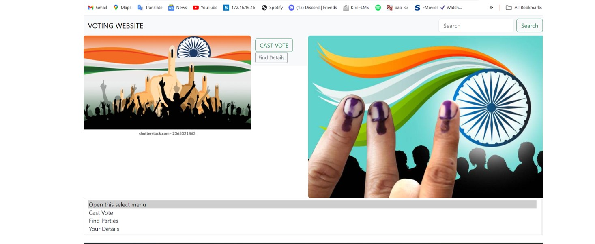

# Voting-web-app
The Voting Web Application is a comprehensive platform designed to enable users to create and participate in various voting polls. Leveraging Django for the backend and HTML, CSS, and JavaScript for the frontend, this project required a full stack development approach. As a full-stack developer, I was responsible for both the backend and frontend development, ensuring seamless integration between the two layers.

